# AWSPriceListAPIをPowreShellからさわってみる

AWSPriceListがリージョン毎取得出来るようになったようなのでPowreshellでAPIを叩いてリージョン毎のPriceListを取得してみたり表示してみたりするスクリプトを作成してみたのとAWSpriceListAPIって何者かを紹介してみる。

## そもそもAWSPriceListAPIってどんなもの？

AWSの各サービスの料金表を取得できるAPI。

元々はサービスの全リージョンデータのみ取得というなかなかハードな仕様だったが。
ある時からサービスのリージョン毎の価格が取得できるように変更された。

[AWS Price List API Update – Regional Price Lists](https://aws.amazon.com/jp/blogs/aws/aws-price-list-api-update-regional-price-lists/)

取得出来る価格表のフォーマットはcsvとjsonファイルとなっている。

`https://pricing.us-east-1.amazonaws.com/offers/v1.0/aws/index.json`

2017年12月現在は、更に細かい単位でデータが抽出出来るようになっているが、本資料では説明しない。

[AWS 料金表 API の更新 – 新しいクエリとメタデータ関数](https://aws.amazon.com/jp/blogs/news/aws-price-list-api-update-new-query-and-metadata-functions/?sc_channel=sm&sc_campaign=AWS_Blog&sc_publisher=FACEBOOK&sc_country=Japan&sc_geo=JAPAN&sc_outcome=awareness&trk=_FACEBOOK&sc_content=AWS)

## AWSPriceListAPIで価格が取得出来るサービスの一覧を取得する

AWSPriceListAPIでは利用出来るサービスの一覧が下記URLにアクセスするとjson形式で取得できる。

`https://pricing.us-east-1.amazonaws.com/offers/v1.0/aws/index.json`

```Powershell
$index = Invoke-RestMethod -Uri https://pricing.us-east-1.amazonaws.com/offers/v1.0/aws/index.json -Method Get
PS>$index | Format-List *
```

▶Invoke-RestMethodでindexファイルを取得  
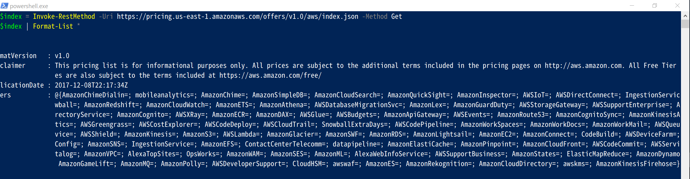

取得したオブジェクトのoffersプロパティに価格リストを提供しているサービスのindexに関する情報が記載されている。

▶offersプロパティの中に各種サービス毎にNotePropertyが登録されている。
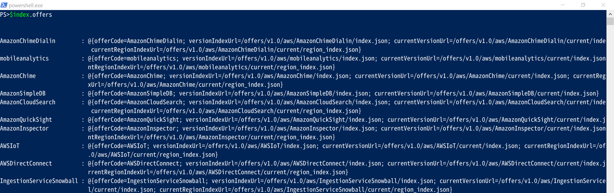

▶試しにAmazonEC2を表示してみると、
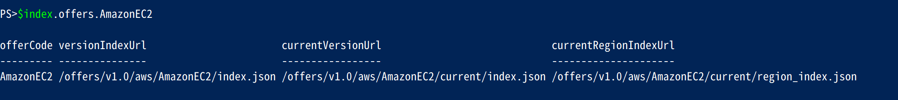

- offerCode
- versionIndexUrl
- currentVersionUrl
- currentRegionIndexUrl

というNotePropertyが存在しているが、これはそれぞれ下記のような意味となっている。

Name                  | Description
--------------------- | ---------------------------------------------------------------------------------------
offerCode             | サービス名
versionIndexUrl       | AmazonEC2のPriceListのバージョン情報が格納されているIndexファイル(json)のURLが記載
currentVersionUrl     | AmazonEC2の全リージョン版価格ファイル(json)のURLが記載
currentRegionIndexUrl | AmazonEC2の各リージョン版価格ファイルへの情報が記載されたIndexファイル(json)のURLが記載

### offerCode

offerCodeはそのままの意味でサービスの名称。

### versionIndexUrl

▶versionIndexUrlはいつ時点の価格情報か記載されているIndexファイルへのurlが記載されている。  
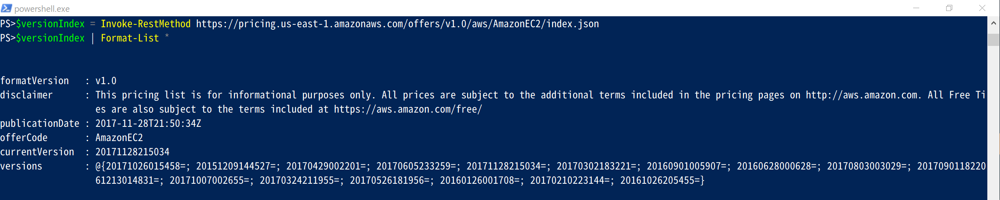

### currentVersionUrl

▶currentVersionUrlは各サービス(この場合はAmazonEC2)の全リージョンの価格データが記載されているjsonファイルへのURL。
ちなみに2017年12月現在、AmazonEC2の全リージョン版価格jsonファイルは173MByteあるようです……なかなかのサイズ。ちなみに拡張子をjsonからcsvに変更するとcsv版の全リージョン価格ファイルが取得できます。

下記はInvoke-WebRequestで全リージョンの価格リストをc:\temp\ディレクトリに保存するサンプルコード。  

```Powershell
#json版のAmazonEC2全リージョンの価格リストを取得する
Invoke-WebRequest https://pricing.us-east-1.amazonaws.com/offers/v1.0/aws/AmazonEC2/current/index.json -OutFile c:\temp\ec2.json

#csv版のAmazonEC2全リージョンの価格リストを取得する
Invoke-WebRequest https://pricing.us-east-1.amazonaws.com/offers/v1.0/aws/AmazonEC2/current/index.csv -OutFile c:\temp\ec2.csv
```

### currentRegionIndexUrl

リージョン毎に価格ファイルが取得出来るようになった際に追加された項目。
各リージョンの価格ファイルへのurlが記載されたindexファイルになっている。

currentRegionIndexUrlに記載されているURLのファイルを取得してみると下記のようになっている。

```Powershell
$regionIndex = Invoke-RestMethod https://pricing.us-east-1.amazonaws.com/offers/v1.0/aws/AmazonEC2/current/region_index.json -Method Get

$regionIndex | Format-List *

```

▶各リージョン毎のファイルのindex情報ファイルになっている事が確認できる。  
またNotePropertyのregionsに提供されている各リージョン毎の価格ファイルが記載されている。  
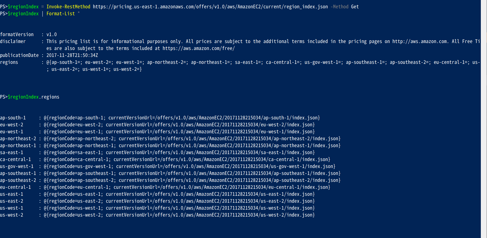

▶試しにtokyoRegion(ap-northeast-1)の価格ファイルのURLを確認してみる。  
ちなみにこのURLの末尾をjsonからcsvに変更するとcsv形式の価格ファイルが取得できます。  
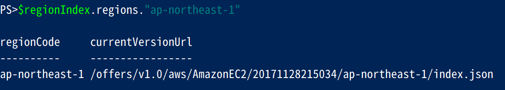

▶Invoke-WebRequestでjson形式とcsv形式のapn1(tokyo)の価格ファイルを取得してみる。  
ちなみに2017年12月現在、AmazonEC2のAPN1リージョン(tokyo)の価格jsonファイルは14MByteあるようです。全リージョン版が173Mbyteなので大分救われている感があります。  


```Powershell
Invoke-WebRequest https://pricing.us-east-1.amazonaws.com/offers/v1.0/aws/AmazonEC2/20171128215034/ap-northeast-1/index.json -OutFile c:\temp\apn1-ec2.json
Invoke-WebRequest https://pricing.us-east-1.amazonaws.com/offers/v1.0/aws/AmazonEC2/20171128215034/ap-northeast-1/index.csv -OutFile c:\temp\apn1-ec2.csv
```

## 作成したスクリプトファイルの説明

今回、下記のようなスクリプトを作成してみた。

scriptFile               | 説明
------------------------ | ----------------------
Get-AWSPriceList.ps1     | 価格リストファイルのダウンロードスクリプト
Out-AWSPriceListView.ps1 | 価格リストファイル(json)のproductとtermsを紐付けて表示する。

## Get-AWSPriceList.ps1

▶Get-AWSPriceList.ps1を実行  
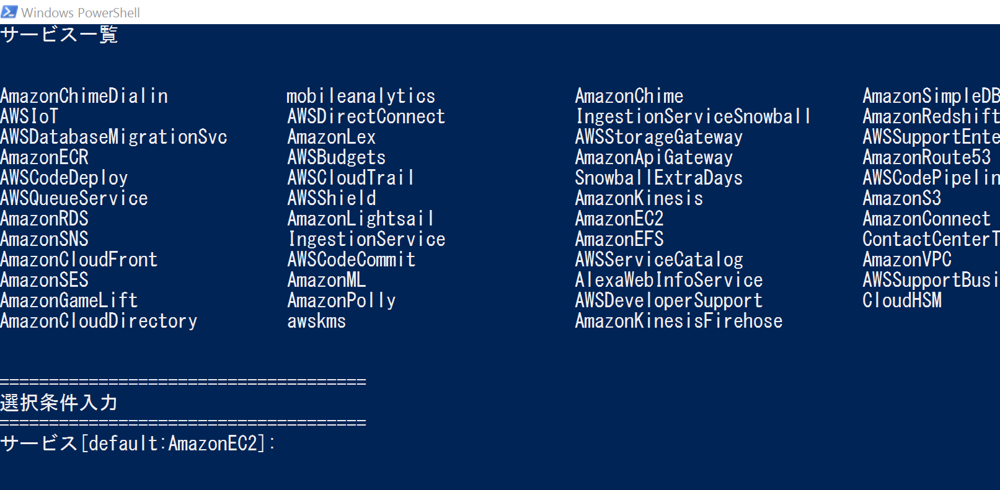

▶AWSPriceListでサポートされているサービスの一覧が出力される。  
ついで、選択条件入力画面が表示されるので欲しいファイルの条件を入力する。  
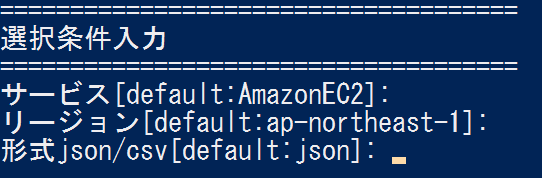

入力が無い時はデフォルト値が設定される。

- AmazonEC2
- ap-northeast-1 東京
- json

なおサービス名とリージョン名はパターン入力が利用できるようにしているので。
サービス名 *
とか指定すると全サービスのファイルが取得できます。

ファイルのダウンロード場所はスクリプトが格納されている同階層のdownloadFileというフォルダに行う。
フォルダが無ければ該当フォルダを作成して保存します。

ファイル名はサービス名.リージョン名.刊行日.拡張子。

## View-AWSPriceList.ps1

AmazonEC2とAmazonS3のjsonファイルの情報を表示出来ることを目標に作成してみました。

とりえあず全項目表示してみたが、他サービスのjsonファイルでも動くかどうかは未確認。

▶スクリプトを実行  
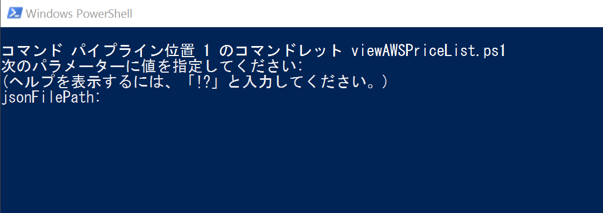

▶jsonファイルのパスを入れろとでるので入力してenter。  
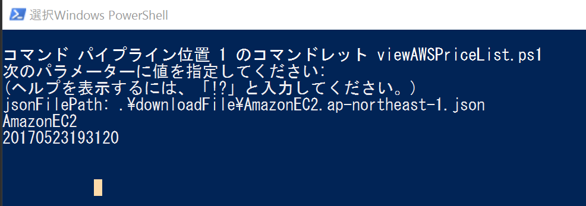

▶しばらく待つとgrid-viewで情報が参照できる。  
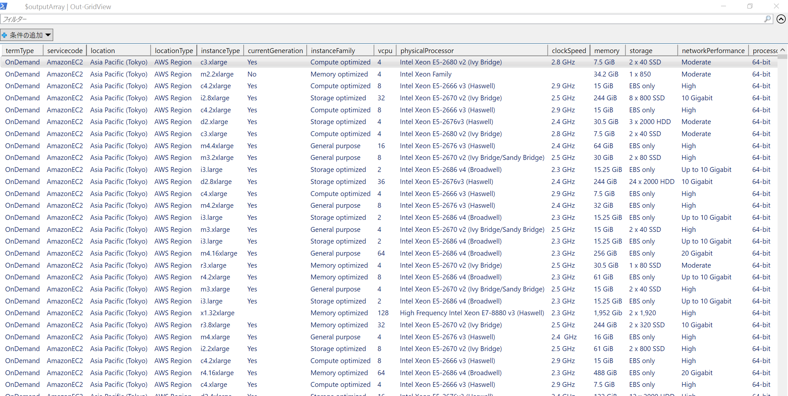

AmazonEC2の場合。情報の大半がリザーブドが占めるので、オンデマンド価格のみでリザーブドが必要ない場合はリザーブドを抜く用にしたほうがいいかも？　今のところ無条件でオンデマンド・リザーブド全表示している。
